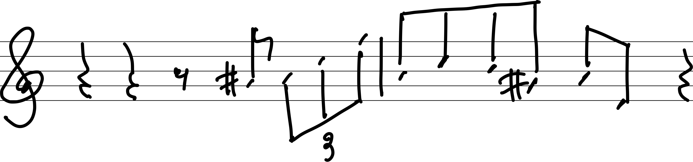

* 記号
  * 自然数全体の集合: $\mathbb{N}$
  * 整数全体の集合: $\mathbb{Z}$
  * 有理数全体の集合: $\mathbb{Q}$
  * 実数全体の集合: $\mathbb{R}$
  * 複素数全体の集合: $\mathbb{C}$
  * 命題: $p,q,r\dots$
  * $x$についての条件（述語）: $p(x),q(x)\dots$, あるいは単に$p,q,\dots$
  * 真理集合: 条件の真理集合は, 条件を表すアルファベットの大文字で表す.
    * 例: 条件$p$の真理集合は$P$である. 

---

* 条件（述語）
  * 条件は変数$x_0,~x_1\cdots,x_n$に関する文である。
  * 変数には範囲がある.
  * 条件は次を満たす文である。
    * 変数に具体的な値を入れると真偽が定まる。

* 命題
  * 命題は真偽が判定できる文である。
  * 変数をとって, 「$n$に関する命題」という表現をしばしば見かける。
  * $0$変数の述語は命題と同じである。
  * ※ 単に命題を述べただけでは, 真の命題であるとは言っていない。
  * 真の命題であることを述べたいときには, 命題だけでなく, その命題が真であることを述べなければならない。
  * 「命題$p$は真の命題である。」と同等な表現
    * 「$p$は真である。」
    * 「$p$が成り立つ。」
  * 「命題$p$は偽の命題である。」と同等な表現
    * 「$p$は偽である。」
    * 「$p$は成り立たない。」
  

* 真理値
  * 真: 「正しい」ことを表す値
  * 偽: 「正しくない」ことを表す値
  * 命題も条件も真理値を返す。

以降, 断りなく$p,q$と出てきた場合には, それらは命題であるとする。

* でない（命題の否定）
  * 真の命題を否定すると偽の命題になる。
  * 偽の命題を否定すると真の命題になる。
  * 命題$p$の否定を$\lnot p$と書くことがある。
  * 命題$p$に関する否定はしばしば「命題$p$の否定命題」と呼ばれる。
  * $\lnot(\lnot p)=p$が成り立つ。

* または
  * 「$p$または$q$」は, 命題$p$か命題$q$のどちらか一方が真のとき, 真となる命題である。
  * 「$p$または$q$」は, $p$も$q$も偽のときに限り偽となる命題である。

* かつ
  * 「$p$かつ$q$」は, 命題$p$か命題$q$のどちらか一方が偽のとき, 偽となる命題である。
  * 「$p$かつ$q$」は, $p$も$q$も真のときに限り真となる命題である。
  * 上の「または」の説明と併せて読むと, 「または」と「かつ」とは対称的な存在であることがわかる。

* ならば
  * $p$を真にするような値全体が$q$も真にするとき, 「$p$ならば$q$は真である」という。
  * 「$p$ならば$q$」は, 「$p$が偽または, $q$が真」のとき, 真になる命題である。
  * 「$p$ならば$q$」は, 「$p$が真かつ, $q$が偽」のとき, 偽になる命題である。
  * 「$p$ならば$q$」は次と同じである。
    * 「$p\rightarrow q$」
    * 「$p\Rightarrow q$」
    * 「$\lnot p\lor q$」

* $\forall x, [p(x)\Rightarrow q(x)]$
  * $p$を真にするすべての値が$q$を真にするとき, $\forall x, [p(x)\rightarrow q(x)]$と書く。
  * 文ではしばしば, 「すべての（$\forall x$）」は省略される場合は少なくないので, 適宜自分で補う必要がある。
  * 「$\forall x, [p(x)\Rightarrow q(x)]$」は「$p(x)\Rightarrow q(x)$」と書かれることもある。
  * 「すべての値が」は「どんな値をとっても」にするとわかりやすい場合がある。
  * $\forall x, [p(x)\Rightarrow q(x)]$は命題である。
    * $\because$ 真偽が一意に定まる文であるから。

---

* 関連する例
  * $2x=1$
    * $x=1/2$のとき, $1=1$となり, 「$2x=1$」は真である。
    * $x=3$のとき, $6=1$となり, 「$2x=1$」は偽である。
    * 場合によって, 変数の具体的な範囲が省略される場合がある。
    * 今回, $x\in\mathbb{R}$を省略している。
  * $x\in\mathbb{R},~x^2=-1$
    * $x^2\geq 0$より, 「$x^2=-1$」は常に偽の命題である。（恒偽命題）
  * $x\in\mathbb{C},~x^2=-1$
    * $x=i$のとき, $i^2=-1$となり「$x^2=-1$」は真である。
    * $x\neq i$のとき, 「$x^2=-1$」は偽である。
  * 「方程式を解く」とは, 真理集合を定めることに他ならない。

<!--* 整数$n$について, $n^2$が$3$の倍数ならば$n$は$3$の倍数であることを示せ。
    * $n$が$3$の
  * $\sqrt{3}$が無理数であることを示せ。
    * 「$\sqrt{3}$は無理数である」の否定は, 「$\sqrt{3}$は有理数である」である。
    * $\sqrt{3}$が有理数であると仮定して矛盾することを示せば良い。
    * $\sqrt{3}=q/p$を満たす互いに素な整数$p,q$が存在する。
      * 互いに素な整数は最大公約数が$1$の整数である。
    * $\sqrt{3}=q/p\Leftrightarrow 3p^2=q^2$が成り立つ。-->
  

* 図のテスト

